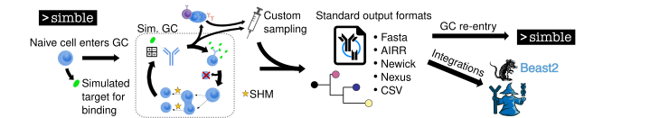

How simble works
================

|

simble is an agent-based simulator of heterogenous evolution, specializing in B cell 
evolution and differentiation in germinal centers (GCs). Briefly, a starting pair of 
BCR heavy and light chain sequences is randomly chosen from a dataset of naive 
single B cells. GC B cells mutate according to models of SHM (somatic hypermutation) targeting, and 
affinity is calculated based on similarity to a target amino acid sequence. B cells 
proliferate proportionally to their relative affinity. GC B cells differentiate 
into memory B cells (MBCs) early on before shifting to mainly plasma cell production.
simble incorporates recently discovered aspects of GC reactions, including transient
silencing of SHM during clonal bursts and a log-additive relationship between 
mutations and affinity.
